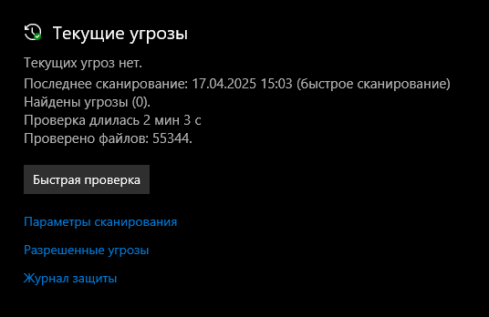
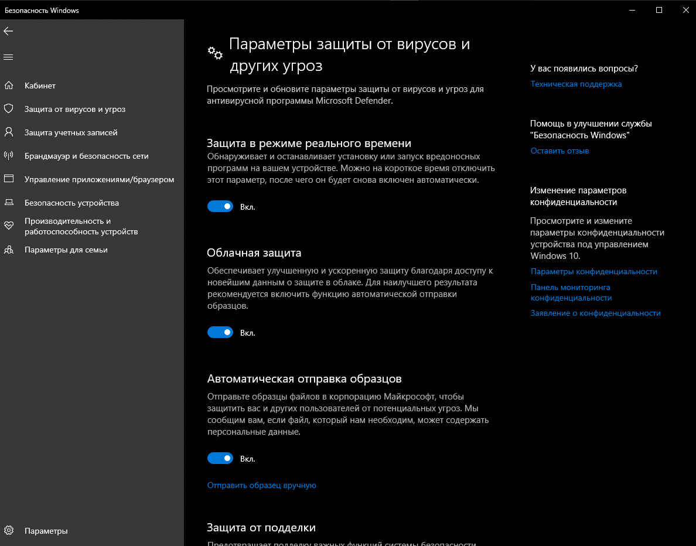
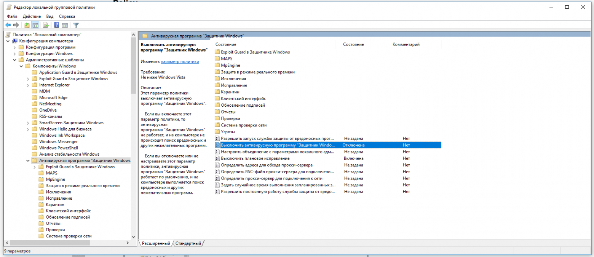
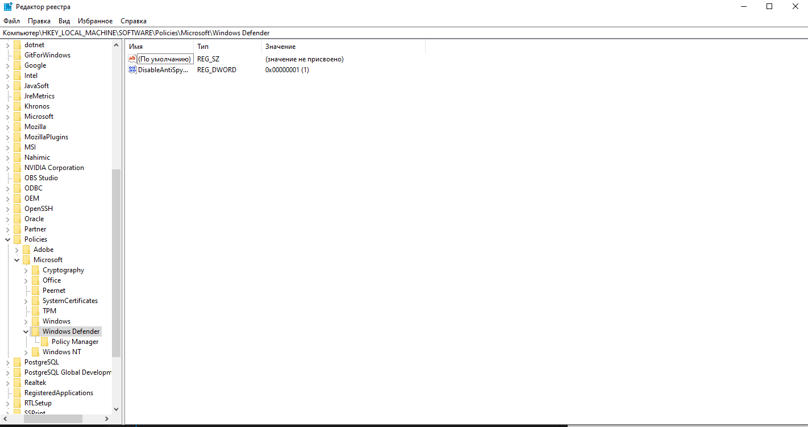
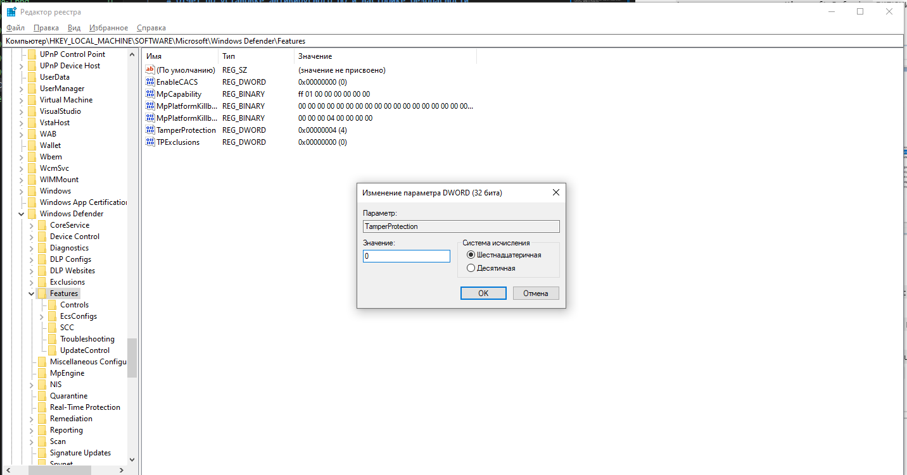
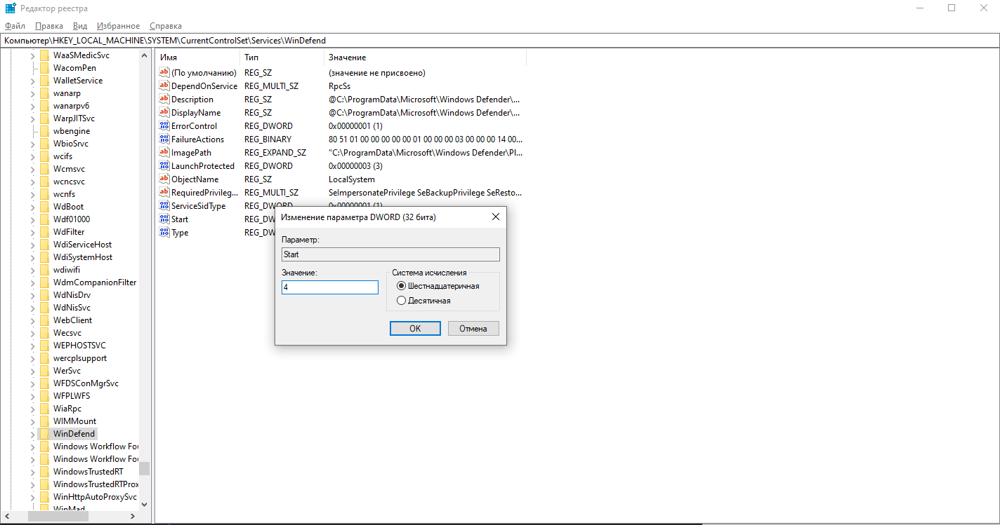
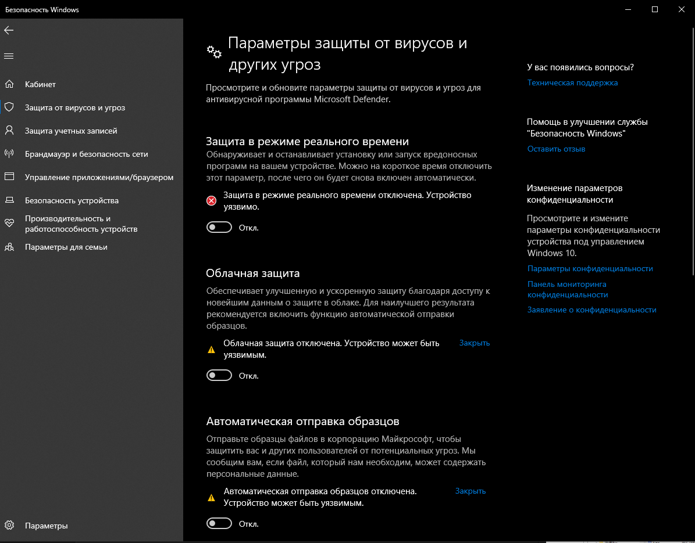

# Отчёт по установке антивирусного ПО и настройке безопасности

## 1. Обоснование выбора антивирусного ПО

Исследованы три популярных антивируса: Avast, Kaspersky и Windows Defender. Сравнительная таблица представлена ниже:

| Антивирус | Плюсы | Минусы | Бесплатная версия | Потребление ресурсов |
| --- | --- | --- | --- | --- |
| Avast | \- Удобный интерфейс - Хорошая базовая защита - Есть бесплатная версия | \- Навязывает установку доп. ПО - Реклама в бесплатной версии | Да | Среднее |
| Kaspersky | \- Высокий уровень защиты - Мало ложных срабатываний - Много дополнительных функций | \- Платный (но есть беслпатная версия) - Требует регистрации | Да | Высокое |
| Windows Defender | \- Встроен в Windows - Не требует установки - Минимальная нагрузка на систему | \- Меньше функций - Средняя защита от сложных угроз | Да | Низкое |

**Выбранный антивирус:** Windows Defender\
**Почему выбран именно он:** Выбран из-за низкого потребления ресурсов, отсутствия необходимости установки и достаточной базовой защиты для учебных целей. Подходит для слабых ПК и не требует дополнительных затрат.

## 2. Установка антивируса

- **Где скачали:** Установка не требовалась, так как Windows Defender встроен в операционную систему Windows.
- **Что предлагалось установить дополнительно:** Ничего не предлагалось.
- **Какие опции выбрали:** Не применимо, так как антивирус уже активирован по умолчанию.

**Скриншоты:** Скриншоты не требуются, так как установка не проводилась.

## 3. Первичная настройка безопасности

Выполнены следующие действия по настройке Windows Defender:

- ✅ Об anticipation обновление баз данных (проверено в "Безопасность Windows" → "Защита от вирусов и угроз" → "Проверить обновления").
- ✅ Включена активная защита (по умолчанию активна в реальном времени).
- ✅ Проведена полная проверка системы (запущена вручную, результаты сохранены).
- ✅ Включены следующие функции:
[x] Фаерволл (активирован в "Брандмауэр Защитника Windows").
[ \] Защита USB-устройств (не поддерживается в базовой версии).
[ \] Родительский контроль (не настраивался, так как не требуется).
  [x\] Веб-защита/блокировка вредоносных сайтов 

**Скриншоты:** 

## 4. Дополнительные меры безопасности
Выполнены следующие дополнительные действия:

1. **Обновление системы Windows:**
   - Открыты "Параметры" → "Обновление и безопасность" → "Центр обновления Windows".
   - Установлены все доступные обновления, включая исправления безопасности.
2. **Смена пароля на вход:**
   - В "Параметрах" → "Учетные записи" → "Варианты входа" установлен новый пароль длиной 12 символов, включающий буквы, цифры и специальные символы.
3. **Отключение автозапуска с флешек:**
   - В "Панели управления" → "Автозапуск" снята галочка с "Использовать автозапуск для всех устройств и носителей".

- [x] Обновление системы Windows / драйверов
- [x] Смена или установка надёжного пароля на вход
- [ ] Включение BitLocker или другого шифрования
- [x] Отключение автозапуска с флешек
- [ ] Настройка двухфакторной аутентификации
- [ ] Удаление подозрительных/неиспользуемых программ

## 5. Настройка двухфакторной аутентификации

Была включена двухфакторная аутентификация на Google:

- **Google:**
  - Зайти в аккаунт Google → "Безопасность" → "Двухэтапная аутентификация".
  - Установлено приложение Google Authenticator, отсканирован QR-код, сохранены резервные коды.

## 6. Итоги

- **Что нового узнали:** Научился настраивать двухфакторную аутентификацию и отключать автозапуск для повышения безопасности. Узнал, как работает встроенный Windows Defender и как оптимизировать его настройки.
- **Что было непонятно или вызвало трудности:** Настройка некоторых дополнительных функций (например, защита USB-устройств) оказалась недоступной в бесплатной версии Windows Defender.
- **Выводы:** Регулярное обновление системы, использование сложных паролей и двухфакторной аутентификации значительно повышают уровень безопасности. Антивирус — важная, но не единственная часть защиты данных.

## 6.1 + Балл

### 2. Отключение через групповую политику ()
- Запустил `gpedit.msc`.
- В разделе `Конфигурация компьютера → Административные шаблоны → Компоненты Windows → Антивирусная программа Microsoft Defender` включил параметр "Выключить антивирусную программу Microsoft Defender".

- **Скриншот:**

### 3. Отключение через реестр
- В `HKEY_LOCAL_MACHINE\SOFTWARE\Policies\Microsoft\Windows Defender` создал параметры:
  - `DisableAntiSpyware` = `1`.
- В `HKEY_LOCAL_MACHINE\SOFTWARE\Microsoft\Windows Defender\Features` установил `TamperProtection` = `0`.
- Отключил службы в `HKEY_LOCAL_MACHINE\SYSTEM\CurrentControlSet\Services`:
  - Для `WinDefend`, `WdNisSvc`, `WdFilter`, `WdBoot` установил `Start` = `4`.
- **Скриншот:** 

### 6. Проверка результата
- В "Безопасности Windows" раздел "Защита от вирусов и угроз" неактивен.
- Процесс `MsMpEng.exe` отсутствует в диспетчере задач.
- **Скриншот:** 

